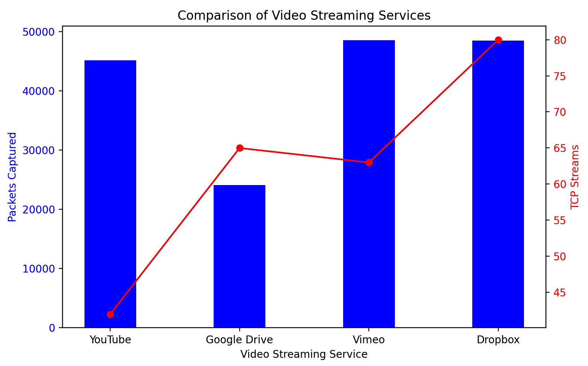
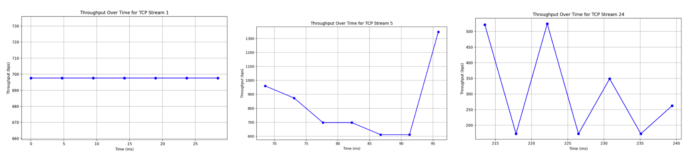
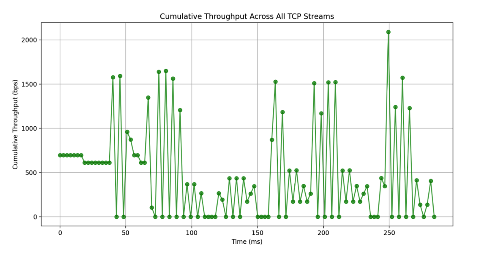
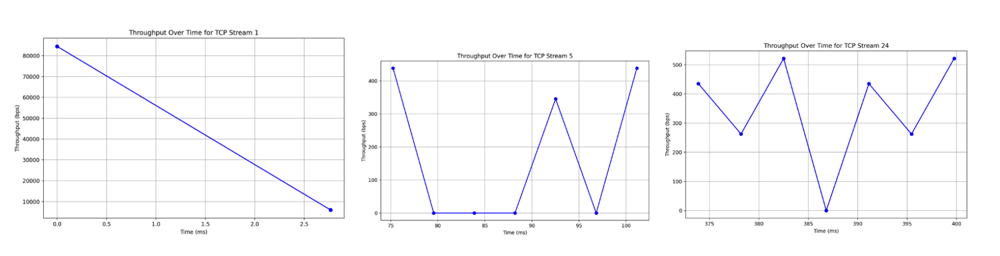
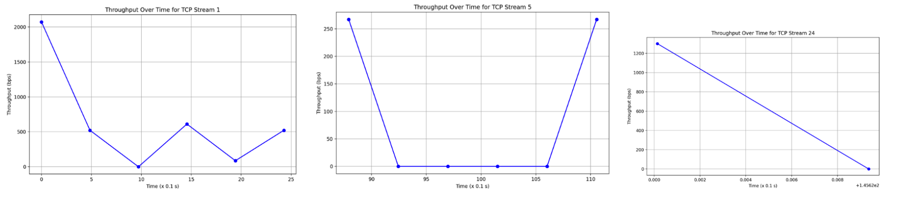
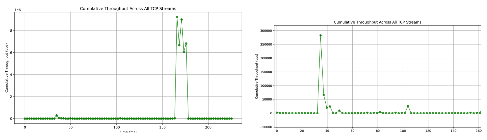
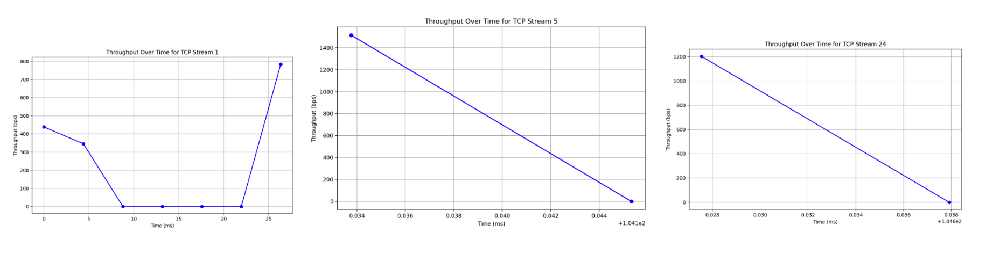
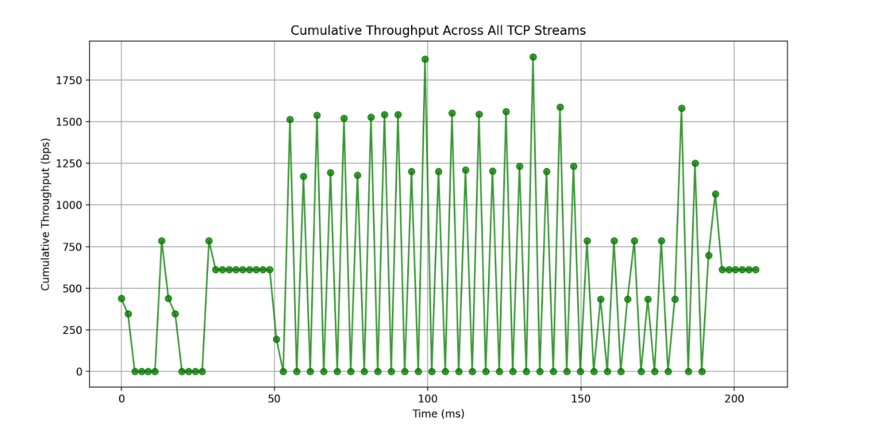

# Reverse-Engineering HTTP Video Streaming

## Introduction

This project investigates how different video streaming services (YouTube, Vimeo, Dropbox, and Google Drive) deliver video content over HTTP. By capturing and analyzing network traffic traces, we reverse-engineer the streaming strategies used by these services. Specifically, our analysis focuses on:

- **Connection Persistence:**  
  Determining whether a video server uses a persistent (single TCP connection) or non-persistent (multiple TCP connections) strategy during a video streaming session.

- **Bit-Rate Analysis:**  
  Analyzing if the video server uses constant bit-rate streaming or variable bit-rate streaming that adapts to network conditions. We evaluate this by plotting the amount of data received per unit time (e.g., every 200 ms).

-**Windowing: Keep in Mind:**
  It should be noted that when choosing a sampling window for packet capture, longer windows may result in oversaturation of plotting points, making it difficult to distinguish variations, while shorter windows may not capture enough fluctuation, leading to an incomplete representation of throughput behavior. After testing various options, we settled on a 5-second window, as it provided the cleanest and most interpretable results in our analysis.

## Project Overview

This project uses the following tools and libraries:
- **Wireshark:** For capturing network traffic and saving the capture as a pcap file.
- **PyShark:** A Python wrapper for Wireshark that allows parsing of pcap files.
- **Matplotlib:** For plotting the throughput over time to visually inspect the streaming behavior.

The analysis script (`analyze_video_stream.py`) processes the pcap file to:
1. Group TCP packets by their stream identifier to assess the persistence of TCP connections.
2. Compute and plot throughput over fixed time windows to determine whether the video streaming is constant or variable bit-rate.

## Prerequisites

- **Python 3.x**
- **Wireshark** (or any similar packet capture tool)
- **Python Packages:**
  - [PyShark](https://pypi.org/project/pyshark/)
  - [Matplotlib](https://pypi.org/project/matplotlib/)

### Installation

Install the required Python packages using pip:

```bash
pip install pyshark matplotlib
```

### Project Structure
```bash .
├── analyze_video_stream.py  # Main analysis script 
├── README.md                # This README file 
└── video_stream.pcap
```
###Python Code for analyzing Video Stream
[View analyze_video_stream.py](./analyze_video_stream.py)

### Usage

```bash
python analyze_video_stream.py video_stream.pcap --time_window 5
```

The `--time_window` is optional. It is to adjust the time window for throughput calculation (our default was 5 seconds)

### 3. Interpret the Results

#### Connection Persistence
The script analyzes the number of TCP streams used during a video session.

- **Single TCP Stream:** Indicates a persistent connection.
- **Multiple TCP Streams:** Suggests non-persistent connections or multiple connection reuse.

#### Bit-Rate Analysis
The script generates throughput plots (bits per second) over time to identify the streaming behavior.

- **Constant Throughput:** Suggests constant bit-rate streaming.
- **Fluctuating Throughput:** Suggests adaptive streaming that adjusts to network conditions.

## Analysis Details

### Connection Persistence Analysis

- **Methodology:**  
  The script uses Wireshark’s `tcp.stream` field to group packets into streams. By counting the number of unique streams, we determine whether the session is using a single persistent connection or multiple connections.

- **Interpretation:**  
  - **1 TCP Stream:** Persistent connection.
  - **>1 TCP Stream:** Non-persistent connections or connection reuse.

### Bit-Rate Analysis

- **Methodology:**  
  The script bins packet data over fixed time intervals (default: 200 ms) and calculates the throughput in bits per second.  
  - **Plotting:** A line plot of throughput vs. time is generated for each TCP stream.
  - **Cumulative Throughput Function**
    The cumulative throughput function aggregates the throughput of all TCP streams, providing an overall view of the data transferred during the session. This helps visualize total throughput over time as if it were a continuous stream.

- **Interpretation:**  
  - **Constant Throughput:** Likely constant bit-rate streaming.
  - **Variable Throughput:** Likely adaptive streaming that changes bit-rate based on network conditions.

## Figures & Plots

- **Figure 1:** Overview of TCP Streams, Packet Count per Streaming Service  
  *Description: A diagram showing the number of TCP streams and packet count increase for each service as identified during the analysis.*

  

- **Figures 2 and 3:** Throughput Plots for YouTube  
  *Description: A throughput vs. time plot for a video streaming session on YouTube. As well as the cumulative plot*

  
  
  

- **Figures 4 and 5:** Throughput Plots for Vimeo  
  *Description: A throughput vs. time plot for a video streaming session on Vimeo. As well as the cumulative plot*

  
  
  

- **Figure 6 and 7:** Throughput Plot for Dropbox  
  *Description: A throughput vs. time plot for a video streaming session on Dropbox. As well as the cumulative plot*

  
  
  

- **Figure 8 and 9:** Throughput Plot for Google Drive  
  *Description: A throughput vs. time plot for a video streaming session on Google Drive. As well as the cumulative plot*

  
  
  

## Experimentation

For a fair and thorough comparison:
- Ensure similar video content and duration across all services.
- Use the same WiFi network and similar link conditions for each capture.
- Experiment by varying link quality (e.g., moving the device farther from the access point or placing it behind a wall) to observe how each service adapts its streaming bit-rate.

## Conclusion

This project provides insights into the streaming strategies used by popular video services by analyzing connection persistence and bit-rate adaptation. We determined that all analyzed services utilized persistent TCP connections, leveraging multiple streams to transfer packets efficiently. Instead of relying on a single TCP connection, these services strategically employed multiple TCP streams to enhance data transfer efficiency, improve resilience to packet loss, and optimize congestion management.

Each service dynamically switched between multi-bitrate streaming and steady-rate streaming. When network conditions fluctuated, adaptive multi-bitrate streaming adjusted throughput to ensure smooth playback. Conversely, during stable network conditions, steady-rate streaming facilitated efficient and consistent video delivery.

It is important to note that plot variations across services may arise due to differences in video quality settings during playback. While video duration and network conditions were controlled, streaming platforms may have automatically adjusted resolution and compression settings based on internal algorithms, device capabilities, or initial bandwidth estimation. As a result, some services exhibited higher throughput fluctuations, indicating adaptive streaming responding to perceived network conditions, while others maintained a steadier throughput pattern, suggesting a pre-buffered or fixed-bitrate approach.

Ultimately, these findings offer valuable insights into how streaming services optimize content delivery, balancing performance and quality by adapting to network congestion, device capabilities, and real-time bandwidth availability.
